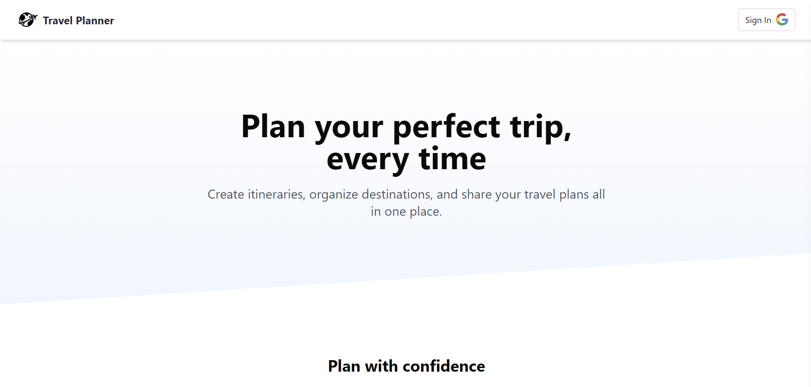

# Trips Planner App 🌍✈️

A modern, interactive web application for planning, managing, and visualizing your trips. Track visited locations, organize itineraries, upload trip images, and explore your travel history in a dynamic 3D globe view.

---

## Live Demo

Check out the app here: [Travel Planner App](https://travel-planner-liard-two.vercel.app/)

## Features

- **User Authentication**: Sign in with Gmail for a secure experience.
- **Landing Page**: Engaging homepage with introduction and call-to-action.
- **Create New Trip**: Users can add a new trip with title, description, dates, and an image
- **Trip Detail Page**: Each trip has a dedicated page with tabs for:
  - **Overview**: Trip summary and details
  - **Itinerary**: Drag-and-drop reordering of locations
  - **Map**: Interactive map showing all locations in the trip
- **All Trips Page**: View all trips with a "load more" functionality.
- **3D Globe**: Visualize all visited countries on a 3D globe.
- **Responsive Design**: Works seamlessly on desktop and mobile.
- **Notifications**: Success/error messages using `react-hot-toast`.

---

## Tech Stack

- **Frontend**: React, Next.js, Tailwind CSS, TypeScript
- **Backend / Database**: Prisma ORM, PostgreSQL (hosted on Neon)
- **Hosting / Deployment**: Vercel
- **Maps & Location Services**: Google Maps API
- **File Uploads**: UploadThing
- **Authentication**: Gmail OAuth / Google Auth

---

## Screenshots & Media

### Landing Page



### All Trips Page


### Trip Detail Tabs


### 3D Globe


## Environment Variables

Create a `.env.local` file in the root directory and add the following:

```env
DATABASE_URL="YOUR_URL"

# Auth
AUTH_GOOGLE_ID="YOUR_ID"
AUTH_GOOGLE_SECRET="yOUR_SECRET"
AUTH_SECRET="YOUR_SECRET"

# File uploads
UPLOADTHING_TOKEN='YOUR_TOKEN'

# Google Maps
# For anything that runs in the browser (Maps JavaScript API, Places Autocomplete, etc.)
NEXT_PUBLIC_GOOGLE_MAPS_API_KEY="YOUR_KEY"

# For server-side use only (Geocoding API, Distance Matrix, etc.)
GOOGLE_MAPS_SERVER_KEY="YOUR_KEY"

---
```
